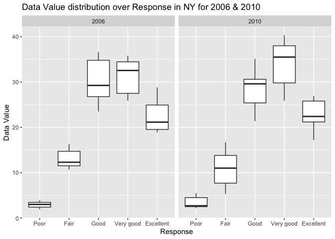

P8105_hw3_yc3577
================
Yimeng Cai
10/12/2023

``` r
library(p8105.datasets)
library(tidyverse)
```

    ## ── Attaching core tidyverse packages ──────────────────────── tidyverse 2.0.0 ──
    ## ✔ dplyr     1.1.3     ✔ readr     2.1.4
    ## ✔ forcats   1.0.0     ✔ stringr   1.5.0
    ## ✔ ggplot2   3.4.3     ✔ tibble    3.2.1
    ## ✔ lubridate 1.9.2     ✔ tidyr     1.3.0
    ## ✔ purrr     1.0.1     
    ## ── Conflicts ────────────────────────────────────────── tidyverse_conflicts() ──
    ## ✖ dplyr::filter() masks stats::filter()
    ## ✖ dplyr::lag()    masks stats::lag()
    ## ℹ Use the conflicted package (<http://conflicted.r-lib.org/>) to force all conflicts to become errors

``` r
data("instacart")

instacart = instacart |> as_tibble()
```

This dataset contains 1384617 rows and 15 columns, with each row
resprenting a single product from an instacart order. Variables include
identifiers for user, order, and product; the order in which each
product was added to the cart. There are several order-level variables,
describing the day and time of the order, and number of days since prior
order. Then there are several item-specific variables, describing the
product name (e.g. Yogurt, Avocado), department (e.g. dairy and eggs,
produce), and aisle (e.g. yogurt, fresh fruits), and whether the item
has been ordered by this user in the past. In total, there are 39123
products found in 131209 orders from 131209 distinct users. Below is a
table summarizing the number of items ordered from aisle. In total,
there are 134 aisles, with fresh vegetables and fresh fruits holding the
most items ordered by far.

``` r
instacart |>
  count(aisle) |>
  arrange(n, desc = FALSE)
```

    ## # A tibble: 134 × 2
    ##    aisle                          n
    ##    <chr>                      <int>
    ##  1 beauty                       287
    ##  2 frozen juice                 294
    ##  3 baby accessories             306
    ##  4 baby bath body care          328
    ##  5 kitchen supplies             448
    ##  6 specialty wines champagnes   461
    ##  7 ice cream toppings           504
    ##  8 shave needs                  532
    ##  9 skin care                    534
    ## 10 first aid                    539
    ## # ℹ 124 more rows

``` r
instacart |> 
  count(aisle) |> 
  filter(n > 10000) |> 
  mutate(aisle = fct_reorder(aisle, n)) |> 
  ggplot(aes(x = aisle, y = n)) + 
  geom_point() + 
  labs(title = "Number of items ordered in each aisle") +
  theme(axis.text.x = element_text(angle = 60, hjust = 1))
```

<!-- -->

``` r
instacart |> 
  filter(aisle %in% c("baking ingredients", "dog food care", "packaged vegetables fruits")) |>
  group_by(aisle) |> 
  count(product_name) |> 
  mutate(rank = min_rank(desc(n))) |> 
  filter(rank < 4) |> 
  arrange(desc(n)) |>
  knitr::kable()
```

| aisle                      | product_name                                  |    n | rank |
|:---------------------------|:----------------------------------------------|-----:|-----:|
| packaged vegetables fruits | Organic Baby Spinach                          | 9784 |    1 |
| packaged vegetables fruits | Organic Raspberries                           | 5546 |    2 |
| packaged vegetables fruits | Organic Blueberries                           | 4966 |    3 |
| baking ingredients         | Light Brown Sugar                             |  499 |    1 |
| baking ingredients         | Pure Baking Soda                              |  387 |    2 |
| baking ingredients         | Cane Sugar                                    |  336 |    3 |
| dog food care              | Snack Sticks Chicken & Rice Recipe Dog Treats |   30 |    1 |
| dog food care              | Organix Chicken & Brown Rice Recipe           |   28 |    2 |
| dog food care              | Small Dog Biscuits                            |   26 |    3 |

``` r
instacart |>
  filter(product_name %in% c("Pink Lady Apples", "Coffee Ice Cream")) |>
  group_by(product_name, order_dow) |>
  summarize(mean_hour = mean(order_hour_of_day)) |>
  pivot_wider(
    names_from = order_dow, 
    values_from = mean_hour) |>
  knitr::kable(digits = 2)
```

    ## `summarise()` has grouped output by 'product_name'. You can override using the
    ## `.groups` argument.

| product_name     |     0 |     1 |     2 |     3 |     4 |     5 |     6 |
|:-----------------|------:|------:|------:|------:|------:|------:|------:|
| Coffee Ice Cream | 13.77 | 14.32 | 15.38 | 15.32 | 15.22 | 12.26 | 13.83 |
| Pink Lady Apples | 13.44 | 11.36 | 11.70 | 14.25 | 11.55 | 12.78 | 11.94 |

Problem 2

``` r
library(p8105.datasets)
data("brfss_smart2010")
```

1.  format the data to use appropriate variable names;
2.  focus on the “Overall Health” topic
3.  include only responses from “Excellent” to “Poor”
4.  organize responses as a factor taking levels ordered from “Poor” to
    “Excellent”

``` r
brfss = 
  brfss_smart2010 |>
  as_tibble()

brfss = 
  brfss |>
  janitor :: clean_names() |>
  rename(state = locationabbr, county = locationdesc) |>
  filter(topic %in% 'Overall Health') |>
  mutate(response = fct_relevel(response, 
                                'Poor', 'Fair', 'Good', 'Very good', 'Excellent')) |>
  filter(response %in% c('Poor', 'Excellent'))

brfss
```

    ## # A tibble: 4,250 × 23
    ##     year state county       class topic question response sample_size data_value
    ##    <int> <chr> <chr>        <chr> <chr> <chr>    <fct>          <int>      <dbl>
    ##  1  2010 AL    AL - Jeffer… Heal… Over… How is … Excelle…          94       18.9
    ##  2  2010 AL    AL - Jeffer… Heal… Over… How is … Poor              45        5.5
    ##  3  2010 AL    AL - Mobile… Heal… Over… How is … Excelle…          91       15.6
    ##  4  2010 AL    AL - Mobile… Heal… Over… How is … Poor              66        6.4
    ##  5  2010 AL    AL - Tuscal… Heal… Over… How is … Excelle…          58       20.8
    ##  6  2010 AL    AL - Tuscal… Heal… Over… How is … Poor              35        4.2
    ##  7  2010 AZ    AZ - Marico… Heal… Over… How is … Excelle…         269       27.3
    ##  8  2010 AZ    AZ - Marico… Heal… Over… How is … Poor              62        3.5
    ##  9  2010 AZ    AZ - Pinal … Heal… Over… How is … Excelle…          68       17  
    ## 10  2010 AZ    AZ - Pima C… Heal… Over… How is … Excelle…         133       20.5
    ## # ℹ 4,240 more rows
    ## # ℹ 14 more variables: confidence_limit_low <dbl>, confidence_limit_high <dbl>,
    ## #   display_order <int>, data_value_unit <chr>, data_value_type <chr>,
    ## #   data_value_footnote_symbol <chr>, data_value_footnote <chr>,
    ## #   data_source <chr>, class_id <chr>, topic_id <chr>, location_id <chr>,
    ## #   question_id <chr>, respid <chr>, geo_location <chr>

In 2002, which states were observed at 7 or more locations?

``` r
brfss_2002 =
  brfss |>
  filter(year == '2002') |>
  group_by(year, state) |>
  count(state) |>
  filter( n >= 7) |>
  pivot_wider(
    names_from = year, 
    values_from = state)
```

    ## Warning: Values from `state` are not uniquely identified; output will contain list-cols.
    ## • Use `values_fn = list` to suppress this warning.
    ## • Use `values_fn = {summary_fun}` to summarise duplicates.
    ## • Use the following dplyr code to identify duplicates.
    ##   {data} %>%
    ##   dplyr::group_by(n, year) %>%
    ##   dplyr::summarise(n = dplyr::n(), .groups = "drop") %>%
    ##   dplyr::filter(n > 1L)

``` r
brfss_2002
```

    ## # A tibble: 6 × 2
    ##       n `2002`   
    ##   <int> <list>   
    ## 1     8 <chr [7]>
    ## 2    14 <chr [3]>
    ## 3    16 <chr [2]>
    ## 4    12 <chr [1]>
    ## 5    10 <chr [3]>
    ## 6    20 <chr [1]>

What about in 2010?

``` r
brfss_2010 =
  brfss |>
  filter(year == '2010') |>
  group_by(year, state) |>
  count(state) |>
  filter( n >= 7) |>
  pivot_wider(
    names_from = year, 
    values_from = state)
```

    ## Warning: Values from `state` are not uniquely identified; output will contain list-cols.
    ## • Use `values_fn = list` to suppress this warning.
    ## • Use `values_fn = {summary_fun}` to summarise duplicates.
    ## • Use the following dplyr code to identify duplicates.
    ##   {data} %>%
    ##   dplyr::group_by(n, year) %>%
    ##   dplyr::summarise(n = dplyr::n(), .groups = "drop") %>%
    ##   dplyr::filter(n > 1L)

``` r
brfss_2010
```

    ## # A tibble: 11 × 2
    ##        n `2010`   
    ##    <int> <list>   
    ##  1    24 <chr [3]>
    ##  2    14 <chr [3]>
    ##  3    10 <chr [6]>
    ##  4    82 <chr [1]>
    ##  5     8 <chr [5]>
    ##  6    12 <chr [5]>
    ##  7    18 <chr [2]>
    ##  8    20 <chr [2]>
    ##  9    38 <chr [1]>
    ## 10    16 <chr [1]>
    ## 11    32 <chr [1]>

Construct a dataset that is limited to Excellent responses, and
contains, year, state, and a variable that averages the data_value
across locations within a state.

``` r
brfss_dataset =
  brfss |>
  filter(response == 'Excellent') |>
  select(year, state, data_value) |>
  group_by(year, state) |>
  summarize(mean_dv = mean(data_value))
```

    ## `summarise()` has grouped output by 'year'. You can override using the
    ## `.groups` argument.

``` r
brfss_dataset
```

    ## # A tibble: 443 × 3
    ## # Groups:   year [9]
    ##     year state mean_dv
    ##    <int> <chr>   <dbl>
    ##  1  2002 AK       27.9
    ##  2  2002 AL       18.5
    ##  3  2002 AR       24.1
    ##  4  2002 AZ       24.1
    ##  5  2002 CA       22.7
    ##  6  2002 CO       23.1
    ##  7  2002 CT       29.1
    ##  8  2002 DC       29.3
    ##  9  2002 DE       20.9
    ## 10  2002 FL       25.7
    ## # ℹ 433 more rows

Make a “spaghetti” plot of this average value over time within a state
(that is, make a plot showing a line for each state across years – the
geom_line geometry and group aesthetic will help).

``` r
brfss_spaghetti =
  brfss_dataset |>
  ggplot(aes(x = year, y = mean_dv, color = state, group = state)) + 
  geom_line() +
  labs(
    title = 'Mean Data Value over Time',
    x = 'Year',
    y = 'Average Data Value',
  )

brfss_spaghetti
```

    ## Warning: Removed 3 rows containing missing values (`geom_line()`).

<!-- -->

Make a two-panel plot showing, for the years 2006, and 2010,
distribution of data_value for responses (“Poor” to “Excellent”) among
locations in NY State.

``` r
brfss_box = 
  brfss |>
  filter(state %in% 'NY') |>
  filter(year %in% c('2006','2010')) |>
  ggplot(aes(x = response, y = data_value)) +
  geom_boxplot() +
  facet_grid(. ~ year) +
  labs(
    title = 'Data Value distribution over Response in NY for 2006 & 2010',
    x = 'Response',
    y = 'Data Value'
  )

brfss_box
```

<!-- -->

Problem 3

Load, tidy, merge, and otherwise organize the data sets. Your final
dataset should include all originally observed variables; exclude
participants less than 21 years of age, and those with missing
demographic data; and encode data with reasonable variable classes
(i.e. not numeric, and using factors with the ordering of tables and
plots in mind).

``` r
nhanes_covar =
  read_csv('nhanes_covar.csv', skip = 4) |>
  janitor::clean_names() |>
  filter(age > 21)
```

    ## Rows: 250 Columns: 5
    ## ── Column specification ────────────────────────────────────────────────────────
    ## Delimiter: ","
    ## dbl (5): SEQN, sex, age, BMI, education
    ## 
    ## ℹ Use `spec()` to retrieve the full column specification for this data.
    ## ℹ Specify the column types or set `show_col_types = FALSE` to quiet this message.

Produce a reader-friendly table for the number of men and women in each
education category, and create a visualization of the age distributions
for men and women in each education category. Comment on these items.

Traditional analyses of accelerometer data focus on the total activity
over the day. Using your tidied dataset, aggregate across minutes to
create a total activity variable for each participant. Plot these total
activities (y-axis) against age (x-axis); your plot should compare men
to women and have separate panels for each education level. Include a
trend line or a smooth to illustrate differences. Comment on your plot.

Accelerometer data allows the inspection activity over the course of the
day. Make a three-panel plot that shows the 24-hour activity time
courses for each education level and use color to indicate sex. Describe
in words any patterns or conclusions you can make based on this graph;
including smooth trends may help identify differences.
