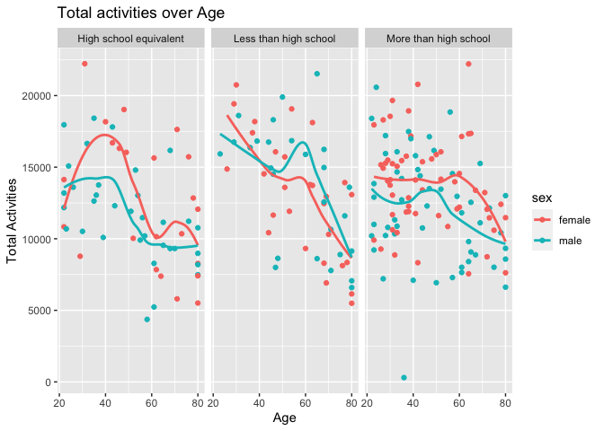

P8105_hw3_yc3577
================
Yimeng Cai
10/12/2023

``` r
library(p8105.datasets)
library(tidyverse)
```

    ## ── Attaching core tidyverse packages ──────────────────────── tidyverse 2.0.0 ──
    ## ✔ dplyr     1.1.3     ✔ readr     2.1.4
    ## ✔ forcats   1.0.0     ✔ stringr   1.5.0
    ## ✔ ggplot2   3.4.3     ✔ tibble    3.2.1
    ## ✔ lubridate 1.9.2     ✔ tidyr     1.3.0
    ## ✔ purrr     1.0.1     
    ## ── Conflicts ────────────────────────────────────────── tidyverse_conflicts() ──
    ## ✖ dplyr::filter() masks stats::filter()
    ## ✖ dplyr::lag()    masks stats::lag()
    ## ℹ Use the conflicted package (<http://conflicted.r-lib.org/>) to force all conflicts to become errors

``` r
data("instacart")

instacart = instacart |> as_tibble()
```

This dataset contains 1384617 rows and 15 columns, with each row
resprenting a single product from an instacart order. Variables include
identifiers for user, order, and product; the order in which each
product was added to the cart. There are several order-level variables,
describing the day and time of the order, and number of days since prior
order. Then there are several item-specific variables, describing the
product name (e.g. Yogurt, Avocado), department (e.g. dairy and eggs,
produce), and aisle (e.g. yogurt, fresh fruits), and whether the item
has been ordered by this user in the past. In total, there are 39123
products found in 131209 orders from 131209 distinct users. Below is a
table summarizing the number of items ordered from aisle. In total,
there are 134 aisles, with fresh vegetables and fresh fruits holding the
most items ordered by far.

``` r
instacart |>
  count(aisle) |>
  arrange(desc(n))
```

    ## # A tibble: 134 × 2
    ##    aisle                              n
    ##    <chr>                          <int>
    ##  1 fresh vegetables              150609
    ##  2 fresh fruits                  150473
    ##  3 packaged vegetables fruits     78493
    ##  4 yogurt                         55240
    ##  5 packaged cheese                41699
    ##  6 water seltzer sparkling water  36617
    ##  7 milk                           32644
    ##  8 chips pretzels                 31269
    ##  9 soy lactosefree                26240
    ## 10 bread                          23635
    ## # ℹ 124 more rows

Next is a plot that shows the number of items ordered in each aisle.
Here, aisles are ordered by ascending number of items.

``` r
instacart |> 
  count(aisle) |> 
  filter(n > 10000) |> 
  mutate(aisle = fct_reorder(aisle, n)) |> 
  ggplot(aes(x = aisle, y = n)) + 
  geom_point() + 
  labs(title = "Number of items ordered in each aisle") +
  theme(axis.text.x = element_text(angle = 60, hjust = 1))
```

<!-- --> Our
next table shows the three most popular items in aisles
`baking ingredients`, `dog food care`, and `packaged vegetables fruits`,
and includes the number of times each item is ordered in your table.

``` r
instacart |> 
  filter(aisle %in% c("baking ingredients", "dog food care", "packaged vegetables fruits")) |>
  group_by(aisle) |> 
  count(product_name) |> 
  mutate(rank = min_rank(desc(n))) |> 
  filter(rank < 4) |> 
  arrange(desc(n)) |>
  knitr::kable()
```

| aisle                      | product_name                                  |    n | rank |
|:---------------------------|:----------------------------------------------|-----:|-----:|
| packaged vegetables fruits | Organic Baby Spinach                          | 9784 |    1 |
| packaged vegetables fruits | Organic Raspberries                           | 5546 |    2 |
| packaged vegetables fruits | Organic Blueberries                           | 4966 |    3 |
| baking ingredients         | Light Brown Sugar                             |  499 |    1 |
| baking ingredients         | Pure Baking Soda                              |  387 |    2 |
| baking ingredients         | Cane Sugar                                    |  336 |    3 |
| dog food care              | Snack Sticks Chicken & Rice Recipe Dog Treats |   30 |    1 |
| dog food care              | Organix Chicken & Brown Rice Recipe           |   28 |    2 |
| dog food care              | Small Dog Biscuits                            |   26 |    3 |

Finally is a table showing the mean hour of the day at which Pink Lady
Apples and Coffee Ice Cream are ordered on each day of the week. This
table has been formatted in an untidy manner for human readers. Pink
Lady Apples are generally purchased slightly earlier in the day than
Coffee Ice Cream, with the exception of day 5.

``` r
instacart |>
  filter(product_name %in% c("Pink Lady Apples", "Coffee Ice Cream")) |>
  group_by(product_name, order_dow) |>
  summarize(mean_hour = mean(order_hour_of_day)) |>
  pivot_wider(
    names_from = order_dow, 
    values_from = mean_hour) |>
  knitr::kable(digits = 2)
```

    ## `summarise()` has grouped output by 'product_name'. You can override using the
    ## `.groups` argument.

| product_name     |     0 |     1 |     2 |     3 |     4 |     5 |     6 |
|:-----------------|------:|------:|------:|------:|------:|------:|------:|
| Coffee Ice Cream | 13.77 | 14.32 | 15.38 | 15.32 | 15.22 | 12.26 | 13.83 |
| Pink Lady Apples | 13.44 | 11.36 | 11.70 | 14.25 | 11.55 | 12.78 | 11.94 |

``` r
    ## `summarise()` has grouped output by 'product_name'. You can override using the
    ## `.groups` argument.
```

Problem 2

First, we need to use `library` and `data` to get our `brfss_smart2010`
data.

``` r
library(p8105.datasets)
data("brfss_smart2010")
brfss_smart2010
```

    ## # A tibble: 134,203 × 23
    ##     Year Locationabbr Locationdesc     Class Topic Question Response Sample_Size
    ##    <int> <chr>        <chr>            <chr> <chr> <chr>    <chr>          <int>
    ##  1  2010 AL           AL - Jefferson … Heal… Over… How is … Excelle…          94
    ##  2  2010 AL           AL - Jefferson … Heal… Over… How is … Very go…         148
    ##  3  2010 AL           AL - Jefferson … Heal… Over… How is … Good             208
    ##  4  2010 AL           AL - Jefferson … Heal… Over… How is … Fair             107
    ##  5  2010 AL           AL - Jefferson … Heal… Over… How is … Poor              45
    ##  6  2010 AL           AL - Jefferson … Heal… Fair… Health … Good or…         450
    ##  7  2010 AL           AL - Jefferson … Heal… Fair… Health … Fair or…         152
    ##  8  2010 AL           AL - Jefferson … Heal… Heal… Do you … Yes              524
    ##  9  2010 AL           AL - Jefferson … Heal… Heal… Do you … No                77
    ## 10  2010 AL           AL - Jefferson … Heal… Unde… Adults … Yes              316
    ## # ℹ 134,193 more rows
    ## # ℹ 15 more variables: Data_value <dbl>, Confidence_limit_Low <dbl>,
    ## #   Confidence_limit_High <dbl>, Display_order <int>, Data_value_unit <chr>,
    ## #   Data_value_type <chr>, Data_Value_Footnote_Symbol <chr>,
    ## #   Data_Value_Footnote <chr>, DataSource <chr>, ClassId <chr>, TopicId <chr>,
    ## #   LocationID <chr>, QuestionID <chr>, RESPID <chr>, GeoLocation <chr>

1.  format the data to use appropriate variable names;
2.  focus on the “Overall Health” topic
3.  include only responses from “Excellent” to “Poor”
4.  organize responses as a factor taking levels ordered from “Poor” to
    “Excellent”

We build the tibble with `as_tibble()` first to format the data in the
way we want, and then we need to use `janitor::clean_names()` to format
the variable names. Then we use the rename to simplify the variables
like state and county by
`rename(state = locationabbr, county = locationdesc)`. We use `filter`
function to focus the topic on `Overall Health`. Finally we use the
mutate function to build a new variable called response that only taking
levels from poor to excellent with
`mutate(response = fct_relevel(response, 'Poor', 'Fair', 'Good', 'Very good', 'Excellent'))`.

``` r
brfss = 
  brfss_smart2010 |>
  as_tibble()

brfss = 
  brfss |>
  janitor :: clean_names() |>
  rename(state = locationabbr, county = locationdesc) |>
  filter(topic %in% 'Overall Health') |>
  mutate(response = fct_relevel(response, 
                                'Poor', 'Fair', 'Good', 'Very good', 'Excellent'))

brfss
```

    ## # A tibble: 10,625 × 23
    ##     year state county       class topic question response sample_size data_value
    ##    <int> <chr> <chr>        <chr> <chr> <chr>    <fct>          <int>      <dbl>
    ##  1  2010 AL    AL - Jeffer… Heal… Over… How is … Excelle…          94       18.9
    ##  2  2010 AL    AL - Jeffer… Heal… Over… How is … Very go…         148       30  
    ##  3  2010 AL    AL - Jeffer… Heal… Over… How is … Good             208       33.1
    ##  4  2010 AL    AL - Jeffer… Heal… Over… How is … Fair             107       12.5
    ##  5  2010 AL    AL - Jeffer… Heal… Over… How is … Poor              45        5.5
    ##  6  2010 AL    AL - Mobile… Heal… Over… How is … Excelle…          91       15.6
    ##  7  2010 AL    AL - Mobile… Heal… Over… How is … Very go…         177       31.3
    ##  8  2010 AL    AL - Mobile… Heal… Over… How is … Good             224       31.2
    ##  9  2010 AL    AL - Mobile… Heal… Over… How is … Fair             120       15.5
    ## 10  2010 AL    AL - Mobile… Heal… Over… How is … Poor              66        6.4
    ## # ℹ 10,615 more rows
    ## # ℹ 14 more variables: confidence_limit_low <dbl>, confidence_limit_high <dbl>,
    ## #   display_order <int>, data_value_unit <chr>, data_value_type <chr>,
    ## #   data_value_footnote_symbol <chr>, data_value_footnote <chr>,
    ## #   data_source <chr>, class_id <chr>, topic_id <chr>, location_id <chr>,
    ## #   question_id <chr>, respid <chr>, geo_location <chr>

In 2002, which states were observed at 7 or more locations? In 2002, CT,
FL, MA, NC, NJ, PA these 6 states were observed with 7 or more
locations.

To know which states had observed 7 or more locations in 2002, we
firstly need to use filter to filter our the 2002 year rows with
`filter(year == '2002')`, then, we use `group_by(state)` function to get
each state grouped together. Then we need to count the numbers of
individual distinct county in each states and put the number into a new
columns of `loc_num` by `summarise()`. Finally, we `filter()` the states
with `loc_number >=7` to get the results we want, and `knitr::` the
table.

``` r
brfss_2002 =
  brfss |>
  filter(year == '2002') |>
  group_by(state) |>
  summarise(loc_num = n_distinct(county)) |>
  filter( loc_num >= 7) |>
  knitr::kable()

brfss_2002
```

| state | loc_num |
|:------|--------:|
| CT    |       7 |
| FL    |       7 |
| MA    |       8 |
| NC    |       7 |
| NJ    |       8 |
| PA    |      10 |

What about in 2010? In 2010, CA, CO, FL, MA, MD, NC, NE, NJ, NY, OH, PA,
SC, TX, and WA these 14 states were observed with 7 or more locations.

To know which states had observed 7 or more locations in 2010, we
firstly need to use filter to filter our the 2010 year rows with
`filter(year == '2010')`, then, we use `group_by(state)` function to get
each state grouped together. Then we need to count the numbers of
individual distinct county in each states and put the number into a new
columns of `loc_num` by `summarise()`. Finally, we `filter()` the states
with `loc_number >=7` to get the results we want, and `knitr::` the
table.

``` r
brfss_2010 =
  brfss |>
  filter(year == '2010') |>
  group_by(state) |>
  summarise( loc_num = n_distinct(county))|>
  filter( loc_num >= 7) |>
  knitr::kable()

brfss_2010
```

| state | loc_num |
|:------|--------:|
| CA    |      12 |
| CO    |       7 |
| FL    |      41 |
| MA    |       9 |
| MD    |      12 |
| NC    |      12 |
| NE    |      10 |
| NJ    |      19 |
| NY    |       9 |
| OH    |       8 |
| PA    |       7 |
| SC    |       7 |
| TX    |      16 |
| WA    |      10 |

Construct a dataset that is limited to Excellent responses, and
contains, year, state, and a variable that averages the data_value
across locations within a state.

To construct the dataset that is limited to excellent responses, we use
`filter()` function to focus on `response == 'Excellent'`. Then we use
`select()` function to select the columns only with year, state, and
data_value variables. To make the dataset more clean and easy to
observed, we will use `group_by(year, state)` to help us to see the
values grouped in same year and individual states. Finally, we use
`summarize()` function to get the construct a new column of `mean_dv` to
get the mean of `data_value`. Then we are ready to make the graph.

``` r
brfss_dataset =
  brfss |>
  filter(response == 'Excellent') |>
  select(year, state, data_value) |>
  group_by(year, state) |>
  summarize(mean_dv = mean(data_value))
```

    ## `summarise()` has grouped output by 'year'. You can override using the
    ## `.groups` argument.

``` r
brfss_dataset
```

    ## # A tibble: 443 × 3
    ## # Groups:   year [9]
    ##     year state mean_dv
    ##    <int> <chr>   <dbl>
    ##  1  2002 AK       27.9
    ##  2  2002 AL       18.5
    ##  3  2002 AR       24.1
    ##  4  2002 AZ       24.1
    ##  5  2002 CA       22.7
    ##  6  2002 CO       23.1
    ##  7  2002 CT       29.1
    ##  8  2002 DC       29.3
    ##  9  2002 DE       20.9
    ## 10  2002 FL       25.7
    ## # ℹ 433 more rows

Make a “spaghetti” plot of this average value over time within a state
(that is, make a plot showing a line for each state across years – the
geom_line geometry and group aesthetic will help).

It’s time to make a graph. To make a spaghetti plot, we need to use
`ggplot(aes(x = year, y = mean_dv, color = state, group = state))` to
take in the value of `x = year`, `y = mean_dv`, and specify that we need
to have different states in different colors with `color = state` and
`group = state`. Since it is a spaghetti graph, we need to use
`geom_line()` to plot and add title names and x, y variable names using
`labs(title = 'Mean Data Value over Time', x = 'Year', y = 'Average Data Value')`.
Our spaghetti plot is created and is save to pdf using `ggsave()`.

``` r
brfss_spaghetti =
  brfss_dataset |>
  ggplot(aes(x = year, y = mean_dv, color = state, group = state)) + 
  geom_line() +
  labs(
    title = 'Mean Data Value over Time',
    x = 'Year',
    y = 'Average Data Value')

brfss_spaghetti
```

    ## Warning: Removed 3 rows containing missing values (`geom_line()`).

<!-- -->

``` r
ggsave('brfss_spaghetti.pdf', height = 10, width = 12)
```

    ## Warning: Removed 3 rows containing missing values (`geom_line()`).

Comments: From the graph, we can see that most of the states have mean
data_value range from 16.5 to 27.5, and most of them have up and down
values between 2002 to 2010. Some states like CA and CO had relatively
high mean dv all the time around 28, and some states like WV have an
extreme low mean dv at 2005 and 2007 (below 15). However, though with
variation between the 8 years, the overall change of mean data_value is
relatively small from 2002 to 2010.

Make a two-panel plot showing, for the years 2006, and 2010,
distribution of data_value for responses (“Poor” to “Excellent”) among
locations in NY State.

To make a two-panel plot among locations in NY state, we use
`filter(state %in% 'NY')` to get NY rows selected, then we `filter()`
for the years 2006 and 2010, we need to use
`filter(year %in% c('2006','2010'))`. Now we are ready to plot the
two-panel plot with `ggplot(aes(x = response, y = data_value))` to take
in the value of `x = response`, `y = data_value`. Then we need to use
`geom_boxplot()` to plot the boxplot which is clear to comparison and
use `facet_grid(. ~ year)` to wrap the 1d to 2d. In this case, we are
comparing 2006 and 2010 years so we wrap the variable year to make a
side by box-plot. Then we add title names and x, y variable names using
`labs(title = 'Data Value distribution over Response in NY for 2006 & 2010', x = 'Response', y = 'Data Value')`.
Our two-panel box-plot is created and is save to pdf using `ggsave()`.

``` r
brfss_box = 
  brfss |>
  filter(state %in% 'NY') |>
  filter(year %in% c('2006','2010')) |>
  ggplot(aes(x = response, y = data_value)) +
  geom_boxplot() +
  facet_grid(. ~ year) +
  labs(
    title = 'Data Value distribution over Response in NY for 2006 & 2010',
    x = 'Response',
    y = 'Data Value'
  )

brfss_box
```

<!-- -->

``` r
ggsave('brfss_box.pdf', height = 10, width = 12)
```

Comments: From the graph, we can see that in the two years 2006 and
2010, the response patterns are similar that good and very good
responses have relatively high data value around 30-35, and excellent
response is in the middle around 20-25, then the fair around 10-15 and
lastly the poor having lowest data value below 5. Difference is in 2010,
the very good response obtaining higher data value of around 35 dv along
with high variation (longer box) and the good response having lower data
value of around 32 dv with low variation (shorter box). Excellent is
relatively the same with longer low data value as a tail in 2010, and
fair response having lower variation (shorter box + shorter tail).

Problem 3

Load, tidy, merge, and otherwise organize the data sets. Your final
dataset should include all originally observed variables; exclude
participants less than 21 years of age, and those with missing
demographic data; and encode data with reasonable variable classes
(i.e. not numeric, and using factors with the ordering of tables and
plots in mind).

First, we need to read and load the data by using `read_csv()` and we
need to `skip = 4` to skip the first 4 rows, since these rows only
contain sentences not data. Then we use `janitor::clean_names()` to
clean the variable names. After that, we need to filter the rows to
leave only `age>21` using `filter()`. Then we need to encode the data
with reasonable variable class, we use `mutate()` to recode 1 to male
and 2 to female. We need to do the same to education by recode 1 to
`Less than high school`, 2 to `High school equivalent`, and 3 to
`More than high school`. After recoding, we need to make them as factors
by using
`mutate( sex = as.factors(sex), education = as.factor(education))`.
Finally, we omit the na data by using `drop_na()`.

``` r
nhanes_covar =
  read_csv('nhanes_covar.csv', skip = 4) |>
  janitor::clean_names() |>
  filter(age > 21) |>
  mutate(
    sex = recode(sex, 
                 '1' = 'male',
                 '2' = 'female'),
    education = recode(education,
                       '1' = 'Less than high school',
                       '2' = 'High school equivalent',
                       '3' = 'More than high school'),
    sex = as.factor(sex),
    education = as.factor(education)) |>
  drop_na()
```

    ## Rows: 250 Columns: 5
    ## ── Column specification ────────────────────────────────────────────────────────
    ## Delimiter: ","
    ## dbl (5): SEQN, sex, age, BMI, education
    ## 
    ## ℹ Use `spec()` to retrieve the full column specification for this data.
    ## ℹ Specify the column types or set `show_col_types = FALSE` to quiet this message.

``` r
nhanes_covar
```

    ## # A tibble: 225 × 5
    ##     seqn sex      age   bmi education             
    ##    <dbl> <fct>  <dbl> <dbl> <fct>                 
    ##  1 62161 male      22  23.3 High school equivalent
    ##  2 62164 female    44  23.2 More than high school 
    ##  3 62174 male      80  33.9 More than high school 
    ##  4 62177 male      51  20.1 High school equivalent
    ##  5 62178 male      80  28.5 High school equivalent
    ##  6 62180 male      35  27.9 More than high school 
    ##  7 62184 male      26  22.1 High school equivalent
    ##  8 62189 female    30  22.4 More than high school 
    ##  9 62199 male      57  28   More than high school 
    ## 10 62202 male      36  24.7 Less than high school 
    ## # ℹ 215 more rows

First, we need to read and load the `nhanes_accel.csv` data by using
`read_csv()`. Then we use `janitor::clean_names()` to clean the variable
names. After that, we need to use `pivot_longer()` to make the data
clean and tidy with variable `Number` contain the values of `MIMS` in a
column, so that it can shrink the data into fewer columns. It looks more
clean and tidy.(minized the min1, min2 to min1440 with `min1:min1440`,
and use `values_to = 'MIMS`, Finally, we omit the na data by using
`drop_na()`.

``` r
nhanes_accel = 
  read_csv('nhanes_accel.csv') |>
  janitor::clean_names() |>
  pivot_longer(
    min1:min1440,
    values_to = 'MIMS',
    names_to = 'Number',
    names_prefix = 'min') |>
  drop_na()
```

    ## Rows: 250 Columns: 1441
    ## ── Column specification ────────────────────────────────────────────────────────
    ## Delimiter: ","
    ## dbl (1441): SEQN, min1, min2, min3, min4, min5, min6, min7, min8, min9, min1...
    ## 
    ## ℹ Use `spec()` to retrieve the full column specification for this data.
    ## ℹ Specify the column types or set `show_col_types = FALSE` to quiet this message.

``` r
nhanes_accel
```

    ## # A tibble: 360,000 × 3
    ##     seqn Number  MIMS
    ##    <dbl> <chr>  <dbl>
    ##  1 62161 1      1.11 
    ##  2 62161 2      3.12 
    ##  3 62161 3      1.47 
    ##  4 62161 4      0.938
    ##  5 62161 5      1.60 
    ##  6 62161 6      0.145
    ##  7 62161 7      2.10 
    ##  8 62161 8      0.509
    ##  9 62161 9      1.63 
    ## 10 62161 10     1.20 
    ## # ℹ 359,990 more rows

Joined the two table together.

We joined the two table together using `left_join()` and the join key is
`by = 'seqn'`.

``` r
nhanes_joint = 
  left_join(nhanes_covar, nhanes_accel, by = 'seqn')

nhanes_joint
```

    ## # A tibble: 324,000 × 7
    ##     seqn sex     age   bmi education              Number  MIMS
    ##    <dbl> <fct> <dbl> <dbl> <fct>                  <chr>  <dbl>
    ##  1 62161 male     22  23.3 High school equivalent 1      1.11 
    ##  2 62161 male     22  23.3 High school equivalent 2      3.12 
    ##  3 62161 male     22  23.3 High school equivalent 3      1.47 
    ##  4 62161 male     22  23.3 High school equivalent 4      0.938
    ##  5 62161 male     22  23.3 High school equivalent 5      1.60 
    ##  6 62161 male     22  23.3 High school equivalent 6      0.145
    ##  7 62161 male     22  23.3 High school equivalent 7      2.10 
    ##  8 62161 male     22  23.3 High school equivalent 8      0.509
    ##  9 62161 male     22  23.3 High school equivalent 9      1.63 
    ## 10 62161 male     22  23.3 High school equivalent 10     1.20 
    ## # ℹ 323,990 more rows

Produce a reader-friendly table for the number of men and women in each
education category, and create a visualization of the age distributions
for men and women in each education category. Comment on these items.

In order to make a reader-friendly table, we use
`group_by(sex, education)` to group the joined table in each category.
Then, we are ready to make the plots. We use
`ggplot(aes(x = age, y = education, fill = sex))` to load in the data in
the plot. In this case, we need to do the comparison between different
sex in different education level, so we are using `geom_boxplot()`, and
we use `facet_grid()` to wrap the same sex into each three paralled
boxes to make the graph to be compared. Finally, we use `labs()` to add
title, and variable names.

``` r
nhanes_table =
  nhanes_joint |>
  group_by(sex, education) 


age_plot = 
  nhanes_table |>
  ggplot(aes(x = age, y = education, fill = sex)) +
  geom_boxplot(alpha = 0.5) +
  facet_grid(sex~.) +
  labs(
    title = 'Age Distribution on different Sex across Education Level',
    x = 'Age',
    y = 'Education'
  )

age_plot
```

<!-- -->

``` r
ggsave('age_plot.pdf', height = 10, width = 12)
```

Comments: The overall pattern for borth male and female is that the
education level lower, the mean age is higher for both sex. It makes
sense, since people with older age when they are young back in the
history, they are less likely to receive high education. While, younger
people nowadays are in a modern society, so they are more likely to get
higher education. This follows the trend of how society develops. On
this boxplot, we can see both female and male groups have very similar
distribution when the education level is less than high school. The
female group age is slightly higher than the male group age. (mean
around 61 in female and 60 in male) For the education level equivalent
to high school, female group has mean age larger than the mean age of
the male group age. The whole distribution is shifting to the higher age
for female than male. (mean around 62 for female and around 54 for male)
For the education level higher than high school, both female and male
groups have similar age distribution, with female age mean lower than
male mean age, and the male age has a wider distribution. (mean around
41 for female and around 45 for male)

Traditional analyses of accelerometer data focus on the total activity
over the day. Using your tidied dataset, aggregate across minutes to
create a total activity variable for each participant. Plot these total
activities (y-axis) against age (x-axis); your plot should compare men
to women and have separate panels for each education level. Include a
trend line or a smooth to illustrate differences. Comment on your plot.

In order to make the analysis, we need to make a clean table first by
using `group_by()` to group the same sequence, education, sex, age
together. Then we need to use the `summarise()` to get the sum of the
same grouped sum of MIMS and make it into a new column of
`total_activity`. Then we are ready to make the plot by using the
`nhanes_clean` table with
`ggplot(aes(x = age, y = total_activity, color = sex))` to load in the
data to the plot, and use `geom_point()` to deal with the discrete data
distribution, and then use the `geom_smooth()` to better see the trend
with the smooth line added. Since this case, we need to compare the
different sex total activity levels in each education group, we are
wraping the education into each group with `facet_grid(.~education)`.
Finally, we are adding the title and x,y labels with
`labs(title = 'Total activities over Age',x = 'Age', y = 'Total Activities')`.

``` r
nhanes_clean =
  nhanes_table |>
  group_by(seqn, education, sex, age) |>
  summarise(
    total_activity = sum(MIMS)
  )
```

    ## `summarise()` has grouped output by 'seqn', 'education', 'sex'. You can
    ## override using the `.groups` argument.

``` r
nhanes_clean
```

    ## # A tibble: 225 × 5
    ## # Groups:   seqn, education, sex [225]
    ##     seqn education              sex      age total_activity
    ##    <dbl> <fct>                  <fct>  <dbl>          <dbl>
    ##  1 62161 High school equivalent male      22         13194.
    ##  2 62164 More than high school  female    44         13411.
    ##  3 62174 More than high school  male      80          8579.
    ##  4 62177 High school equivalent male      51         11918.
    ##  5 62178 High school equivalent male      80          7489.
    ##  6 62180 More than high school  male      35         14205.
    ##  7 62184 High school equivalent male      26         13599.
    ##  8 62189 More than high school  female    30         18551.
    ##  9 62199 More than high school  male      57         14548.
    ## 10 62202 Less than high school  male      36         16368.
    ## # ℹ 215 more rows

``` r
activity_plot =
  nhanes_clean |>
  ggplot(aes(x = age, y = total_activity, color = sex)) +
  geom_point() +
  geom_smooth(se = FALSE) +
  facet_grid(.~education) +
  labs(
    title = 'Total activities over Age',
    x = 'Age',
    y = 'Total Activities'
  )

activity_plot
```

    ## `geom_smooth()` using method = 'loess' and formula = 'y ~ x'

<!-- -->

``` r
ggsave('activity_plot.pdf', height = 10, width = 12)
```

    ## `geom_smooth()` using method = 'loess' and formula = 'y ~ x'

Comments: The overall total activity pattern shows a downward
correlation for both sex in each education levels. The decreasing trend
is obvious that when age increased in both male and female groups, the
total activities dropped. For the lower than high school education
level, both male and female have a faster decreasing trend with male a
little higher than female after age 40, and the total activity has a
small peak around 60 for both sex. (Both dropped from 17500 to 8750) For
the education level of high school, both male and female having a low
point around 60 instead and male total activity level is almost always
lower than female and stably decreasing from 15000 to 10000. While
female total activities at first rise surprisingly to around 17500 and
then drops sharply to 100000 and go to next small peak to 12500 and
drops back to 100000. For the education level higher than high school,
both female and male activities are much stable than the other groups
and it drop from 13750 to around 100000, and male has a small peak
around age 50 and female has a small peak later around 60. Overall,
female has higher total activity than male. Overall, the education level
may play a factor to slow down the total activity dropping rate.

Accelerometer data allows the inspection activity over the course of the
day. Make a three-panel plot that shows the 24-hour activity time
courses for each education level and use color to indicate sex. Describe
in words any patterns or conclusions you can make based on this graph;
including smooth trends may help identify differences.

Finally, we make the last plot using `nhanes_table`. We load data inside
the plot with
`ggplot(aes(x = Number, y = MIMS, group = seqn, color = sex))`. In this
case, we are adding `seqn` as individual samples into the plot, so we
need to have `group = seqn`, and then, we are adding points to the graph
with `geom_point(alpha = 0.3)`. Then we need to see the trend more
clearly by adding `geom_smooth(aes(group = sex), se = FALSE)`. Then we
are grouping each education level together as the above plots with
`facet_grid(.~education)`. Finally, we add the title and x,y labels with
`labs()`.

``` r
threepanel_plot =
    nhanes_table |>
  ggplot(aes(x = Number, y = MIMS, group = seqn, color = sex)) +
  geom_point(alpha = 0.3) +
  geom_smooth(aes(group = sex), se = FALSE) +
  facet_grid(.~education) +
  labs(
    title = '24-Hour Activities over Age for Education Level',
    x = 'Time',
    y = 'Total Activities'
  )

threepanel_plot
```

    ## `geom_smooth()` using method = 'gam' and formula = 'y ~ s(x, bs = "cs")'

<!-- -->

``` r
ggsave('threepanel_plot.pdf', height = 10, width = 12)
```

    ## `geom_smooth()` using method = 'gam' and formula = 'y ~ s(x, bs = "cs")'

Comments: Overall pattern shows that both female and male have similar
pattern for the education level below high school, and they both have a
total activities around 25 to 35, and they both get to a lower point
around the 11am at the 24 hours. While the more than high school
education group has a different pattern that male have a high variation
before the small lower point around 8-9am and another high point after
the down time around 2-3pm. The second peak also involve some female
individuals. Moreover, the lower than and equivalent to high school
education groups have male activities dominated while the female
activities dominated for the education level higher than high school.
Therefore, we may get a clue that higher education may play some role
with increasing male total activity level.
